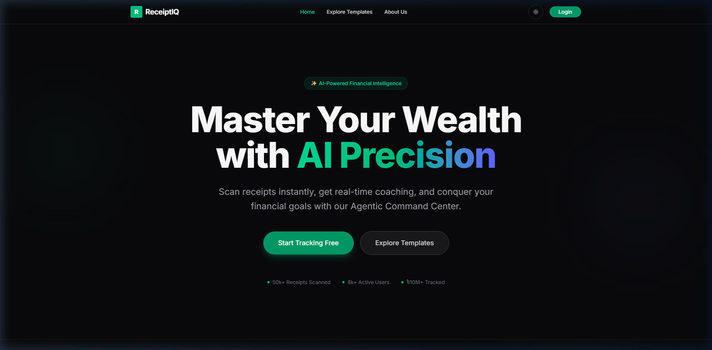

<div align="center">



# 🧾 ReceiptIQ — AI-Powered Financial Intelligence

**Master Your Wealth with AI Precision.**  
Scan receipts instantly, get real-time coaching, and conquer your financial goals with the Agentic Command Center.

[](https://nextjs.org/)
[](https://react.dev/)
[](https://www.typescriptlang.org/)
[](https://tailwindcss.com/)
[](https://vercel.com/)

[🚀 Live Demo](https://receipt-iq-frontend.vercel.app) · [🐛 Report Bug](https://github.com/asif12018/ReceiptIQ-frontend/issues) · [💡 Request Feature](https://github.com/asif12018/ReceiptIQ-frontend/issues)

</div>

---

## 📖 Table of Contents

- [About the Project](#-about-the-project)
- [✨ Features](#-features)
- [🚀 Unique Features](#-unique-features-that-set-receiptiq-apart)
- [🏗️ Project Structure](#️-project-structure)
- [🛠️ Tech Stack](#️-tech-stack)
- [⚙️ Local Setup](#️-local-setup--getting-started)
- [🔑 Environment Variables](#-environment-variables)
- [📦 Scripts](#-scripts)

---

## 🧠 About the Project

**ReceiptIQ** is a next-generation personal finance SaaS platform that combines AI-powered receipt scanning with an agentic financial coaching system. Unlike traditional expense trackers, ReceiptIQ doesn't just log — it **understands**, **advises**, and **coaches** you toward financial freedom.

> 50K+ Receipts Scanned · 8K+ Active Users · $10M+ Tracked

---

## ✨ Features

| Feature | Description |
|---|---|
| 📷 **Receipt Scanning** | Upload & parse receipts with AI-powered OCR extraction |
| 🤖 **Agentic AI Chat** | Real-time Gemini-powered financial assistant |
| 🎯 **Goal Coach** | Set, track, and get AI guidance on savings goals |
| 📊 **Financial Dashboard** | Interactive charts with spending insights via Recharts |
| 📄 **PDF Export** | One-click export of financial reports with AI summary |
| 🌗 **Dark / Light Mode** | Theme-aware UI with system preference detection |
| 📱 **PWA Support** | Install to home screen on any device |
| 🔐 **Auth System** | Secure session-based auth via `better-auth` |
| 🎨 **Explore Templates** | Pre-built budget templates with AI personalization |
| 🗺️ **Onboarding Flow** | Guided financial onboarding modal for new users |
| 🛡️ **Admin Panel** | Role-based admin route for platform management |
| 📞 **Contact & Privacy Pages** | Full legal & support pages with form validation |

---

## 🚀 Unique Features That Set ReceiptIQ Apart

### 1. 🤖 Agentic Command Center
Not just a chatbot — a proactive AI agent that monitors your spending patterns, alerts you to anomalies, and suggests actionable steps. Powered by **Google Gemini** with streaming responses.

### 2. 🎯 AI Goal Coaching
Set financial goals and receive personalized, context-aware micro-coaching messages based on your actual spending data — not generic advice.

### 3. 📄 AI-Generated PDF Reports
Export beautiful, Gemini-narrated financial summaries as PDFs. The AI analyzes your month's data and writes a professional financial summary included in the export.

### 4. 🌀 Premium Motion Design
Built with **GSAP + ScrollTrigger** and **Framer Motion** for buttery-smooth, scroll-synchronized animations. Combined with **Lenis** for native-quality smooth scrolling.

### 5. 🗺️ Guided User Tours
Powered by **Driver.js** — new users receive an interactive, step-by-step tour of the entire dashboard on their first login.

### 6. ⚡ Turbopack + PWA
Built on the bleeding-edge **Next.js 16 + Turbopack** pipeline, with full PWA support via service workers — works offline and installable as a native app.

### 7. 🔒 Zero-Cookie-Loss Proxy Architecture
All backend API calls are routed through Next.js rewrites (`/api/v1/*`), ensuring authentication cookies are never dropped by cross-origin browser policies.

---

## 🏗️ Project Structure

```
ReceiptIQ-frontend/
├── public/                     # Static assets & PWA manifest
│   └── screenshot.png
│
├── src/
│   ├── app/                    # Next.js App Router
│   │   ├── (auth)/             # Auth group: login, register, verify-email
│   │   ├── contact/            # Contact page with RHF + Zod
│   │   ├── dashboard/          # Protected dashboard area
│   │   │   ├── admin/          # Admin-only panel
│   │   │   ├── goals/          # Goal tracking & coaching
│   │   │   ├── profile/        # User profile management
│   │   │   ├── receipts/       # Receipt upload & history
│   │   │   ├── layout.tsx      # Dashboard shell layout
│   │   │   └── page.tsx        # Main dashboard page
│   │   ├── explore/            # Budget template explorer
│   │   ├── privacy-policy/     # Legal / privacy page
│   │   ├── globals.css         # Global styles & CSS variables
│   │   ├── layout.tsx          # Root layout with providers
│   │   ├── not-found.tsx       # Custom 404 page
│   │   ├── page.tsx            # Landing page (Hero + sections)
│   │   └── providers.tsx       # App-wide React providers
│   │
│   ├── components/
│   │   ├── features/           # Landing page section components
│   │   │   ├── AgenticChat.tsx
│   │   │   ├── CTABanner.tsx
│   │   │   ├── FinancialOnboardingModal.tsx
│   │   │   ├── GameChangingFeatures.tsx
│   │   │   ├── GoalCoach.tsx
│   │   │   ├── HowItWorks.tsx
│   │   │   ├── ImpactMetrics.tsx
│   │   │   ├── PlatformCapabilities.tsx
│   │   │   └── Testimonials.tsx
│   │   ├── providers/          # Context providers (Lenis, Theme, Query)
│   │   ├── shared/             # Navbar, Footer, shared UI
│   │   └── ui/                 # shadcn/ui base components
│   │
│   ├── data/                   # Static data & mock content
│   ├── hooks/                  # Custom React hooks
│   │   ├── useChat.ts          # AI chat state management
│   │   ├── useDebounce.ts      # Input debouncing
│   │   ├── useGoals.ts         # Goals CRUD
│   │   ├── useReceipts.ts      # Receipts data fetching
│   │   └── useSettings.ts      # User settings
│   └── lib/
│       ├── auth-client.ts      # better-auth browser client
│       └── utils.ts            # cn() + utility helpers
│
├── .env.local                  # Local environment variables
├── next.config.ts              # Next.js + PWA + API rewrite config
├── tailwind.config.ts          # Tailwind CSS v4 config
├── tsconfig.json               # TypeScript config
└── package.json
```

---

## 🛠️ Tech Stack

| Category | Technology |
|---|---|
| **Framework** | Next.js 16 (App Router, Turbopack) |
| **Language** | TypeScript 5 |
| **Styling** | Tailwind CSS v4 |
| **UI Components** | shadcn/ui + Base UI |
| **Animation** | GSAP + ScrollTrigger, Framer Motion, Lenis |
| **State Management** | Zustand + TanStack Query v5 |
| **Authentication** | better-auth |
| **Forms** | React Hook Form + Zod |
| **Charts** | Recharts |
| **AI** | Google Gemini (via backend) |
| **PDF Export** | react-to-pdf |
| **PWA** | @ducanh2912/next-pwa |
| **User Tour** | Driver.js |
| **Notifications** | Sonner |
| **Deployment** | Vercel (frontend) · Render (backend) |

---

## ⚙️ Local Setup — Getting Started

### Prerequisites

Make sure you have the following installed:

- **Node.js** `v20+` — [Download](https://nodejs.org/)
- **npm** `v10+` (comes with Node.js)
- **Git** — [Download](https://git-scm.com/)

You will also need a running instance of the **ReceiptIQ backend** (or use the hosted one on Render).

---

### Step 1 — Clone the Repository

```bash
git clone https://github.com/asif12018/ReceiptIQ-frontend.git
cd ReceiptIQ-frontend
```

### Step 2 — Install Dependencies

```bash
npm install
```

### Step 3 — Configure Environment Variables

Create a `.env.local` file in the root directory:

```bash
cp .env.example .env.local   # if .env.example exists
# or create manually:
```

```env
# .env.local

# Your local frontend URL
NEXT_PUBLIC_APP_URL="http://localhost:3000"

# API base URL (routed through the Next.js proxy)
NEXT_PUBLIC_API_URL="http://localhost:3000/api/v1"

# Your backend server URL (Node.js / Express backend)
# Use the hosted Render URL or your local backend URL
BACKEND_URL="https://receiptiq-backend.onrender.com"
```

> **Note:** `BACKEND_URL` is a **server-only** variable. It powers the Next.js API rewrite proxy and must never have the `NEXT_PUBLIC_` prefix.

### Step 4 — Start the Development Server

```bash
npm run dev
```

Open [http://localhost:3000](http://localhost:3000) in your browser. The app will hot-reload as you make changes.

---

## 🔑 Environment Variables

| Variable | Required | Description |
|---|---|---|
| `NEXT_PUBLIC_APP_URL` | ✅ | Public frontend URL (e.g. `http://localhost:3000`) |
| `NEXT_PUBLIC_API_URL` | ✅ | API base URL used by client-side fetchers |
| `BACKEND_URL` | ✅ | Backend server URL — used by Next.js rewrite proxy (server-only, **never expose to client**) |

### Deploying to Vercel?

Add all three variables in **Vercel Dashboard → Project → Settings → Environment Variables**.  
`BACKEND_URL` is especially critical — without it the build will fail with an invalid rewrite error.

---

## 📦 Scripts

| Command | Description |
|---|---|
| `npm run dev` | Start development server with Turbopack |
| `npm run build` | Create optimised production build |
| `npm run start` | Serve the production build locally |
| `npm run lint` | Run ESLint across the project |

---

## 📸 Screenshots

<div align="center">

<p><em>Landing Page — AI-Powered Financial Intelligence</em></p>
</div>

---

## 🤝 Contributing

Contributions are welcome! Please open an issue first to discuss any changes you'd like to make.

1. Fork the repository
2. Create your feature branch: `git checkout -b feature/amazing-feature`
3. Commit your changes: `git commit -m 'feat: add amazing feature'`
4. Push to the branch: `git push origin feature/amazing-feature`
5. Open a Pull Request

---

## 📄 License

This project is private and submitted as part of a programming contest. All rights reserved © 2026 ReceiptIQ.

---

<div align="center">
  Built with ❤️ using Next.js 16 · Powered by Google Gemini AI
</div>
